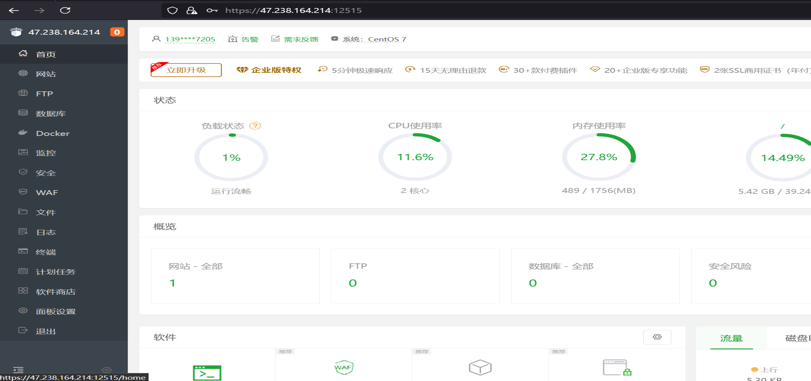
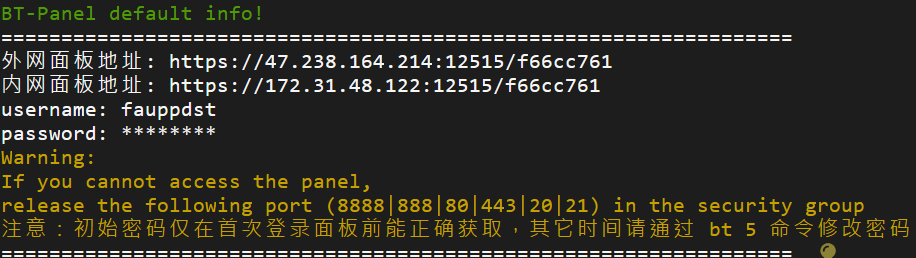
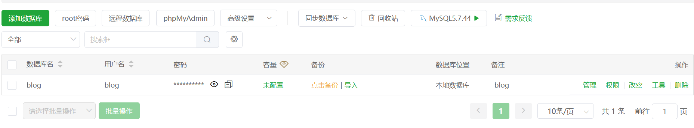
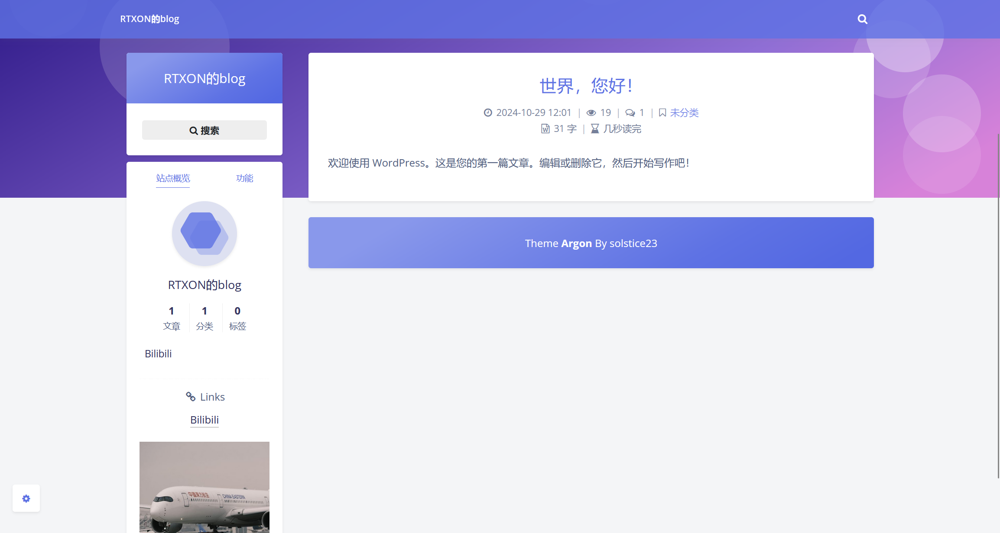

# 2024FallTraining
## 服务器地址 http://47.238.164.214/

## 没钱买域名，最后也找不到怎么部署到github替代最后就用ip代替了
## 基于这个教程https://www.bilibili.com/video/BV1h5411P7HY?
### 第一步白嫖阿里云拿到300元体验金，之后换azure了

### 创建ecs选择香港地区（顺便可以再建个VPN），系统选择centos，cpu内存选择最便宜的就ok
### 安装宝塔面板，远程登录系统后输入
#### url=https://download.bt.cn/install/install_lts.sh;if [ -f /usr/bin/curl ];then curl -sSO $url;else wget -O install_lts.sh $url;fi;bash install_lts.sh ed8484bec
### 等待一会出现如下界面

### 登陆面板

### 创建新数据库

### 输入用户名和数据库名，之后点确定，要牢记密码

### 在宝塔里点击添加站点，链接刚刚创建的数据库，域名为服务器的公网ip地址

### 到wordpress官网
#### https://cn.wordpress.org/
### 下载wordpress并且上传到域名文件里

### 输入ip访问网站并完成初始化

### 使用别人的主题进行优化

