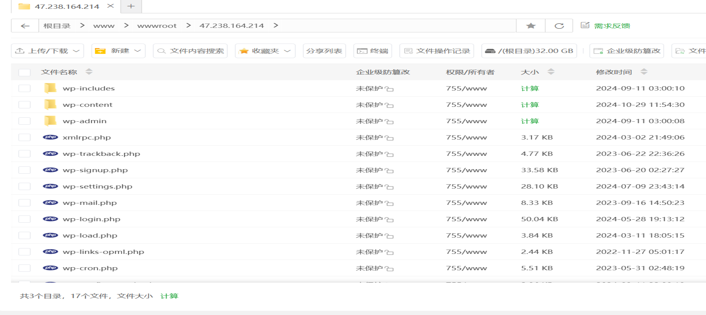

# 2024FallTraining
## 服务器地址 http://47.238.164.214/

## 没钱买域名，最后也找不到怎么部署到github替代最后就用ip代替了
## 基于这个教程https://www.bilibili.com/video/BV1h5411P7HY?
### 第一步白嫖阿里云拿到300元体验金，之后换azure了

### 创建ecs选择香港地区（顺便可以再建个VPN），系统选择centos
### 安装宝塔面板，并登录

### 创建新数据库

### 在宝塔里点击添加站点，链接刚刚创建的数据库

### 下载wordpress并且上传到文件里

### 输入ip访问网站并完成初始化

### 使用别人的主题进行优化

